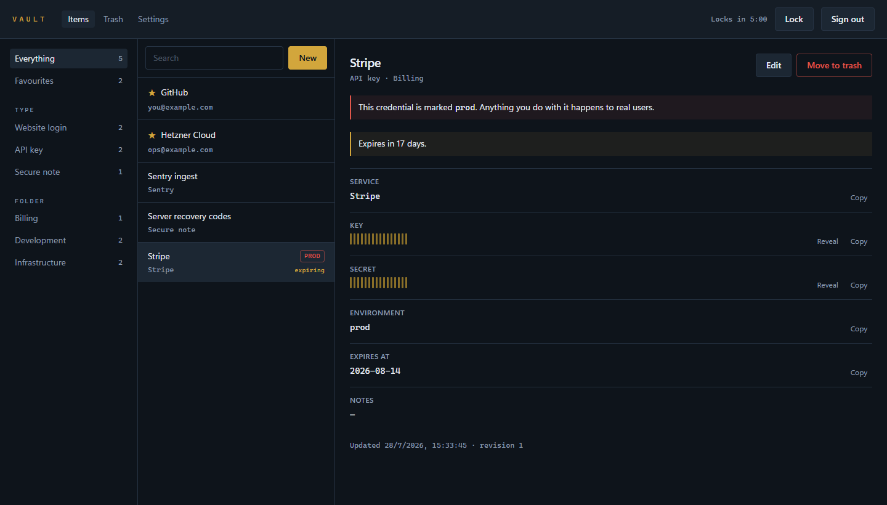
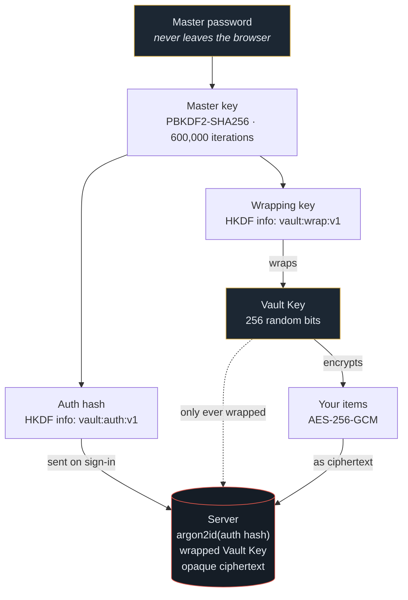
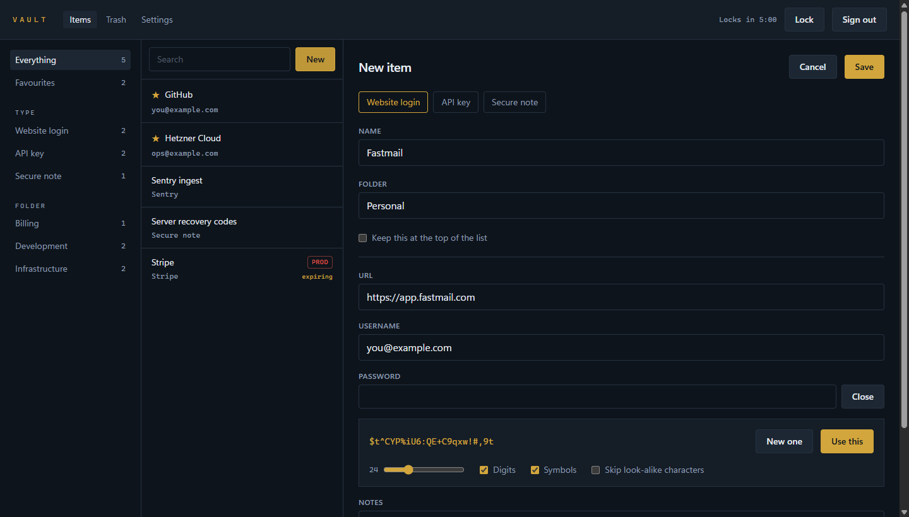

<div align="center">

# Vault

**A self-hosted password and key manager whose server cannot read a single thing it stores.**

[](LICENSE)
[](https://www.php.net)
[](https://laravel.com)
[](https://vuejs.org)
[](https://www.typescriptlang.org)
[](#testing)

[What it is](#what-it-is) · [How it works](#how-it-works) · [Quick start](#quick-start) · [Threat model](#threat-model) · [Deployment](docs/DEPLOYMENT.md)

</div>



---

## What it is

Vault is a **single-user**, **self-hosted** manager for the credentials a developer
actually accumulates: website logins, API keys with environments and expiry dates,
and free-form secure notes.

Every byte of cryptography happens in your browser. The server is a dumb store of
opaque blobs and an authenticator — nothing more. Read its database and you get
ciphertext; read its logs and you get nothing at all.

> [!WARNING]
> **The master password cannot be recovered.** There is no reset email and no
> security question, because the server holds nothing capable of decrypting your
> vault. Lose the password and the vault is gone. Store it somewhere outside this
> system before you put anything in it.

## Why another one

Not to compete with 1Password or Bitwarden. This exists for the case where you
want your credentials on **your own machine, under your own domain**, with a
codebase small enough that you can read all of it in an afternoon and decide for
yourself whether you believe it.

The design goal was not "encrypted at rest". It was: **assume the server is
hostile and see whether the product still works.** It does.

## How it works

Everything descends from the master password, and the two branches that come out
of it are computationally independent — knowing one tells you nothing about the
other.



The **Vault Key** is what actually encrypts your items, and it never changes. That
is what makes changing your master password instant: the key is simply re-wrapped
with a new wrapping key. Nothing is re-encrypted, so the operation is atomic and
cannot half-succeed.

<details>
<summary><b>What the server stores, in full</b></summary>

<br>

| Column | Contents | Useful to an attacker? |
|---|---|---|
| `salt`, `kdf_algo`, `kdf_iterations` | KDF parameters | No — public by design |
| `auth_hash` | argon2id of a value derived from your password | No — one-way, and already one-way before it arrived |
| `wrapped_vault_key`, `vault_key_iv` | The Vault Key, encrypted | Only with the master password |
| `items.ciphertext`, `items.iv` | AES-256-GCM ciphertext | Only with the Vault Key |
| `webauthn_credentials.public_key` | Passkey public keys | No — public keys |

There is no column anywhere that holds a name, a URL, a username or a note. The
item *type* is inside the ciphertext too.

</details>

## Features

| | |
|---|---|
| 🔑 **Three item types** | Website logins, API keys and secure notes, each with the fields that type actually needs |
| 🧬 **Passkeys, not optional** | WebAuthn is a mandatory second factor on every sign-in, on top of the master password |
| 🎲 **A generator that is actually uniform** | Rejection sampling over `crypto.getRandomValues`, never a modulo, with Fisher–Yates from the same source |
| 🫆 **Secrets stay sealed** | Nothing secret renders until you ask, and the sealed state never hints at the length |
| 📋 **Self-wiping clipboard** | Anything copied is overwritten 25 seconds later, with the countdown on screen |
| ⏱️ **Automatic locking** | After inactivity the Vault Key is zeroed in memory; you get a warning before it happens |
| 🗑️ **A trash that empties itself** | Deleted items are destroyed for good after 30 days by a scheduled command |
| 🔄 **Instant password rotation** | Re-wraps the Vault Key instead of re-encrypting the vault |
| 📦 **Export and import** | The export is ciphertext, and it will only import back into a vault holding the same Vault Key |
| 🚨 **Blast-radius warnings** | An API key marked `prod` is flagged in red everywhere; one expiring within 30 days says so |

<details>
<summary><b>Screenshot: the password generator</b></summary>

<br>



Forms are deliberately **not** `<form>` elements. A real one makes browsers offer
to save the credential in their own password manager, which would put a plaintext
copy in exactly the place this vault exists to avoid.

</details>

## Quick start

> [!NOTE]
> Passkeys require a secure context. `http://localhost` counts as one; any other
> domain over plain HTTP does not.

### Locally

```bash
git clone https://github.com/christianpasinrey/vault.git && cd vault
composer install && npm install
cp .env.example .env
php artisan key:generate
php artisan migrate
npm run build
php artisan serve
```

Then, in a second terminal:

```bash
php artisan vault:init
```

It asks for an email address and prints a **single-use link, valid for 15
minutes**. Open it, choose your master password and enrol two passkeys. That is
the entire setup — there is no registration form, because there is no second user.

### On a server

Docker, FrankenPHP and Caddy with automatic HTTPS:

```bash
git clone https://github.com/christianpasinrey/vault.git && cd vault/deploy
cp .env.example .env
$EDITOR .env                 # set VAULT_DOMAIN
docker compose up -d --build
docker compose exec vault php artisan vault:init
```

Full instructions, backups and the update procedure: **[docs/DEPLOYMENT.md](docs/DEPLOYMENT.md)**.

> [!IMPORTANT]
> Before you trust it with anything that matters, work through
> [the checklist](docs/DEPLOYMENT.md#before-you-trust-it-with-your-passwords):
> **two** passkeys on **two** devices, a backup restore you have actually
> performed, and a `.env` that returns 404 over the public internet.

## Threat model

Being specific about this matters more than a list of algorithms.

| Scenario | Are you protected? |
|---|---|
| The server's disk is stolen or the database leaks | ✅ Everything is ciphertext; the master password is not there |
| Someone dumps the database and cracks the `auth_hash` | ✅ It gets them past the login, not past the encryption |
| A backup file ends up somewhere public | ✅ It is the same ciphertext |
| Someone steals your session cookie | ✅ Not enough — the Vault Key is not in the session, and the passkey is required |
| Someone gets your master password but not a passkey | ✅ Sign-in fails; the wrapped key is never handed over |
| Someone gets a passkey but not the master password | ✅ They receive a wrapped key they cannot open |
| You leave the vault unlocked and walk away | ⚠️ Auto-lock buys you minutes, not immunity |
| Your browser or machine is compromised while unlocked | ❌ The Vault Key is in that browser's memory. Nothing can fix this |
| A hostile server operator serves you modified JavaScript | ❌ You are trusting the code you deployed. Self-hosting is the mitigation |
| You forget the master password | ❌ By design. Nothing can be done |

The last three are not oversights — they are the boundary of what browser-side
encryption can promise, and any product claiming otherwise is lying to you.

<details>
<summary><b>Cryptographic parameters</b></summary>

<br>

- **KDF** — PBKDF2-SHA256, 600,000 iterations, 16-byte random salt, 256-bit output
- **Subkeys** — HKDF-SHA256, `info` of `vault:auth:v1` and `vault:wrap:v1`
- **Encryption** — AES-256-GCM, fresh 12-byte IV on every single operation, never reused
- **At rest on the server** — the auth hash is hashed again with argon2id, so a
  database dump does not yield a usable credential
- **Randomness** — `crypto.getRandomValues` in the browser, `random_bytes` on the
  server. `Math.random` and `rand()` appear nowhere in the project

</details>

<details>
<summary><b>Hardening beyond the cryptography</b></summary>

<br>

- A Content-Security-Policy with **no** inline scripts, **no** `unsafe-eval` and
  **no** external origin of any kind. The application ships zero remote fonts,
  scripts or stylesheets, so the policy costs nothing to keep strict
- `frame-ancestors 'none'`, `X-Frame-Options: DENY`, `Referrer-Policy: no-referrer`,
  `X-Robots-Tag: noindex`, and HSTS once you are on HTTPS
- Session cookies are encrypted, `HttpOnly` and `SameSite=Strict`
- The application **refuses to boot** with `APP_DEBUG` enabled in production,
  because one stack trace would render exactly the material this design exists to
  keep off the server
- Optimistic concurrency on every item write: a second device cannot silently
  overwrite your edit
- Rate limiting on sign-in, and a prelogin response that reveals nothing about
  whether an account exists
- Nothing sensitive is versioned: not the SQLite file, not `.env`, not any key

</details>

## Testing

```bash
php artisan test        # 67 backend tests
npm test                # 50 tests: cryptography, clipboard, generator
npm run typecheck       # vue-tsc, strict
./vendor/bin/pint --test
```

Beyond the suites, the whole product has been driven end to end in a real browser
against an isolated instance with a virtual WebAuthn authenticator: setup, passkey
enrolment, item creation, reveal and copy, trash and restore, sign-out and full
sign-in, reload-and-unlock, master password rotation, and an export/import round
trip.

## Project layout

```text
app/
├── Console/Commands/     vault:init (bootstrap), vault:purge (empties the trash)
├── Http/Controllers/     setup, auth, WebAuthn, items, account
├── Http/Middleware/      SecurityHeaders
└── Services/             WebauthnService
resources/js/
├── crypto/               PBKDF2, HKDF, AES-256-GCM, Vault Key wrapping
├── stores/               session, vault, and the Vault Key holder outside Pinia
├── composables/          useAutoLock, useClipboard
├── components/           the workbench, forms and the generator
└── pages/                setup, sign-in, unlock, vault, trash, settings
deploy/                   production Dockerfile, Caddy, compose, backup.sh
docs/                     design, implementation plan and deployment
```

The Vault Key deliberately lives in a **module variable, outside Pinia**: that
way it never appears in the Vue devtools, is never serialized, and does not
survive a page reload. It is overwritten with zeros before the reference is
dropped.[^1]

## Documentation

- 📐 [Technical design](docs/specs/2026-07-27-vault-design.html)
- 🗺️ [Implementation plan](docs/plans/2026-07-27-vault.md)
- 🚀 [Deployment and backups](docs/DEPLOYMENT.md)

## Contributing

Issues and pull requests are welcome. For anything touching the cryptography or
the authentication flow, please open an issue first — those paths have tests
pinning their behaviour deliberately, and a change there needs a discussion
before it needs code.

## License

[MIT](LICENSE) © Christian Pasín Rey

[^1]: Zeroing memory in JavaScript is best-effort — the engine may have copied the
buffer somewhere you cannot reach. It is done because it is strictly better than
not doing it, not because it is a guarantee.
